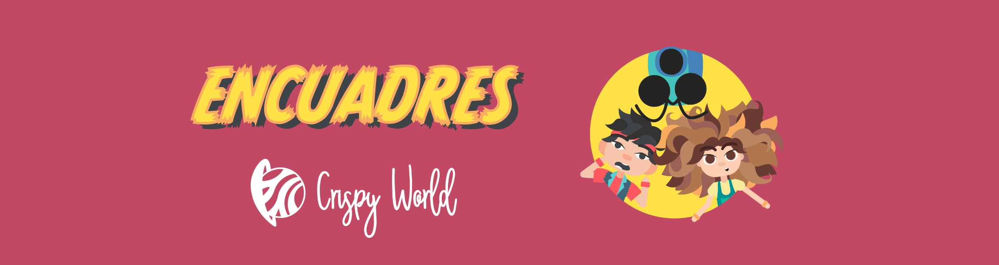

# Encuadres, un cómic animado e interactivo

Este proyecto construye el cómic Encuadres, un cómic animado e interactivo, que puede leerse en https://encuadres.cdalvaro.io

<div align=center>
  
</div>

## Table of Contents

- [Abstract](#abstract)
- [Resumen de la historia](#resumen-de-la-historia)
- [Organización del código](#organización-del-código)

## Abstract

Los medios digitales ofrecen muchas posibilidades para contar historias de una manera única y alejada de los medios tradicionales en papel. Este trabajo explora estas posibilidades, acotando la problemática al **mundo del cómic enfocado a un público infantil.** Para ello, se sigue una aproximación que parte desde el mundo de la animación y acaba en la construcción de un **prototipo final, animado e interactivo,** que puede leerse en el siguiente enlace: https://encuadres.cdalvaro.io

Este trabajo parte de una investigación de los cómics digitales y de aspectos relevantes para un prototipo digital. Con esta base se abarca el proceso de diseño completo: guión y storyboard, diseño y rigging de personajes, modelado 3D de escenarios, animaciones y construcción de un prototipo interactivo final. Este prototipo en formato web se ha distribuido entre el público objetivo, permitiendo la evaluación del mismo como solución válida frente al problema de partida.

## Resumen de la historia

India y Chuck son dos amigos que pasan los veranos en un pueblo de montaña. Un día descubren un paquete perdido. Tiene... ¡una cámara de fotos mágica! La cámara se llama Click y hace fotos mágicas que muestran lo que los niños piensan, sus deseos o sus miedos. Juntos, consiguen hacer una foto que abre una puerta a un mundo mágico. Allí les esperan un montón de aventuras...

## Organización del código

Recursos, imágenes y animaciones utilizadas en el proyecto:

- Tipografías: en `src/assets/fonts`

- Iconos: en `src/assets/icons`

- Colección de viñetas estáticas y viñetas animadas básicas: `src/assets/Vinetas`

- Imágenes y animaciones utilizadas en la viñeta interactiva que muestra la interfaz de Click: `src/assets/PersonajesCamara`

- Colección de polaroids que se muestran en el carrusel de imágenes: `src/assets/Polaroids`

Este proyecto utiliza tres componentes diferentes, que se pueden consultar en `src/components`:

- **`Comic.vue`:** componente con el cuerpo del cómic. Carga todas las viñetas estáticas y llama a los componentes definidos en `Camera.vue`y `Polaroids.vue` en el orden que corresponde. Este componente se encarga, además, de gestionar la viñeta interactiva de la explosión de la caja y la primera aparición de Click. Utiliza la información de `src/assets/Vinetas`

- **`Camera.vue`:** componente que construye la interfaz de Click. Permite la selección del personaje (India o Chuck) y la elección del filtro con el sacar la fotografía (pensamientos, deseos o pesadillas). Cada vez que se pulsa un filtro aparece la animación correspodiente, que puede cerrarse pulsando el icono de cerrar. Utiliza la información de `src/assets/PersonajesCamara`

- **`Polaroids.vue`:** componente que construye el carrusel de fotografías. Cada vez que se selecciona una foto, reajusta las posiciones del resto de polaroids. Utiliza la información de  `src/assets/Polaroids`

Finalmente, la aplicación está construida en **`App.vue`,** desde donde se llama al componente `Comic`. También se construye el banner superior con los botones de selección de sección y se cargan las secciones de personajes y de imágenes. Por último, incluye dos botones más que son enlaces a la memoria del trabajo y a esta página de GitHub.

## Project Setup

```sh
npm install
```

### Compile and Hot-Reload for Development

```sh
npm run dev
```

### Type-Check, Compile and Minify for Production

```sh
npm run build
```
